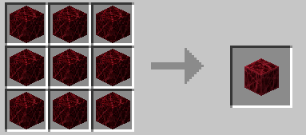

# Ryuko Matoi for Minecraft Bedrock Addon
Ryuko Matoi for Minecraft Bedrock
What is there to say?
I was just bored in the summer, and thought i'd make this for funsies
it's my first minecraft addon really, aside from a few experiments
i'm glad it got this far, cause i really didn't expect it to work at all
This will be awkward to explaion to my IRL friends though

2022 July 4th:	
Things are going well.
It's coming along slowly.
i added life fiber blocks, and a way to spawn matoi in survival
you need lotta strings for it.

CRAFTING RECEPIES as of July 5th:
LIFE FIBER BLOCK

9 Strings

HARDENED LIFE FIBER BLOCK

9 Life Fiber Blocks

RYUKO SPAWN EGG

8 Hardened Life Fiber Blocks + Dragon Egg

SCISSOR BLADE

3 Strings, 3 Hardened Life Fiber Blocks, 1 Red Dye, 1 Netherite Sword
