# Disclaimers:

Kill La Kill, and it's associated charachter belong to Trigger. Studio Trigger wasn't asked for legal permissions for this project. All i have done is make this addon. 
I am willing to take it down upon the request.
Please don't hurt me, i'm just a teen with no money, with a passion for doing things.

# Download & Installation
Download the latest release from https://github.com/Azsimuth/kill-la-kill-Minecraft-Addon/releases \
Change the .zip extension to .mcaddon \
Double click, to open with Minecraft Bedrock \
Chose the world you want to play in, and click the edit icon \
click on behaviour packs, and activate the addon. \
Click on Game \
Scroll down to Experiments \
Enable Holiday Creator Features \
Profit. \

# Ryuko Matoi for Minecraft Bedrock
What is there to say?
I was just bored in the summer, and thought i'd make this for funsies
it's my first minecraft addon really, aside from a few experiments
i'm glad it got this far, cause i really didn't expect it to work at all
This will be awkward to explaion to my IRL friends though

2022 July 4th:	
Things are going well.
It's coming along slowly.
i added life fiber blocks, and a way to spawn matoi in survival
you need lotta strings for it.

# Crafting Recipes as of July 8th:
### LIFE FIBER BLOCK

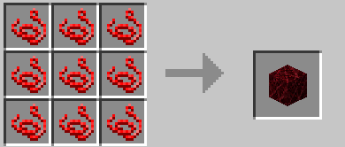

9 Strings

### HARDENED LIFE FIBER BLOCK

9 Life Fiber Blocks

### RYUKO SPAWN EGG

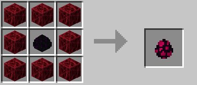

8 Hardened Life Fiber Blocks + Dragon Egg

### SCISSOR BLADE

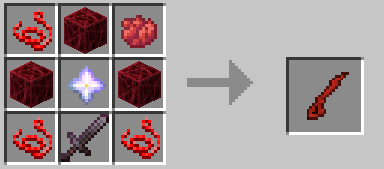

3 Strings, 3 Hardened Life Fiber Blocks, 1 Red Dye, 1 Netherite Sword, 1 Nether Star

### SCISSOR BLADE (NUI)

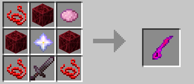

3 Strings, 3 Hardened Life Fiber Blocks, 1 Pink Dye, 1 Netherite Sword, 1 Nether Star

### SCREW

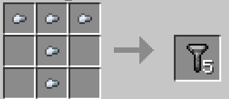

5 Iron Nuggets shaped like a T

### MERGED SCISSOR BLADES

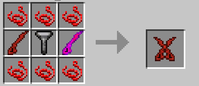

Red Scissor Blade, Screw, Pink Scissor Blade

### SENKETSU

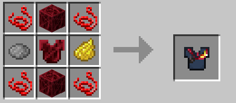

4 Strings, Yellow Dye, Grey Dye, 2 Hardened Life Fiber Blocks, Hardened Life Fiber Chestplate

### SENKETSU SKIRT

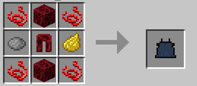

4 Strings, Yellow Dye, Grey Dye, 2 Hardened Life Fiber Blocks, Hardened Life Fiber Leggings

### Junketsu

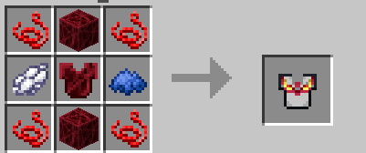

4 Strings, Blue Dye, White Dye, 2 Hardened Life Fiber Blocks, Hardened Life Fiber Chestplate

### Bakuzan

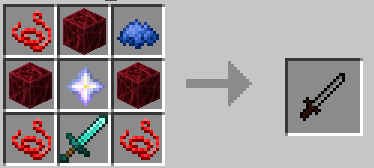

3 Strings, 3 Hardened Life Fiber Blocks, 1 Blue Dye, 1 Diamond Sword, 1 Nether Star

### Wheel

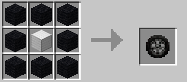

8 Black Wool, 1 Iron Block

### Engine

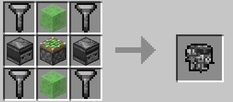

4 Screws, 2 Slime Blocks, 2 Observers, 1 Stick Piston

### Ryuko's Bike

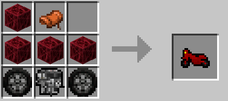

4 Hardened Life Fiber Blocks, 1 Saddle, 1 Engine, and 2 wheels
